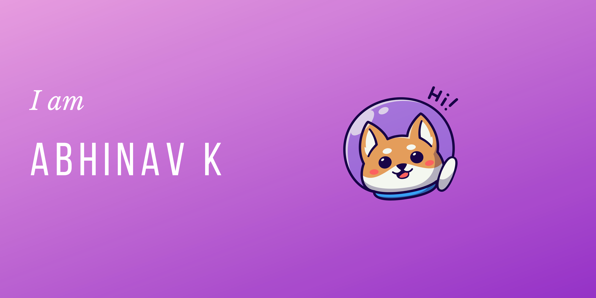

## Hi there 

#### An undergrad student🎓 pursuing Computer Science and Engineering 💻 aspiring to be a backend developer🌐 .

- 🌱 I’m currently learning Javascript.
- 🤔 I’m looking for help with design and CSS.
- 💬 Ask me about python, C/C++, web-dev
- 😄 Pronouns: he/him
- 📫 How to reach me:  
- 📌Check it out👉 <a href="http://yakshas.herokuapp.com/">Blog</a>

### What I'm currently doing 🧑‍💻 :
I'm working on a cool twitter bot that helps share tweet in a style 😃.

#### Stacks being used for this project :
- Cloudflare workers: Backend is being developed as a serverless app on cloudflare using JavaScript.
- ReactJS: Obviously for the frontend 😁.

## My Github stats 💻️ :

## Language stats 🌏️ :

